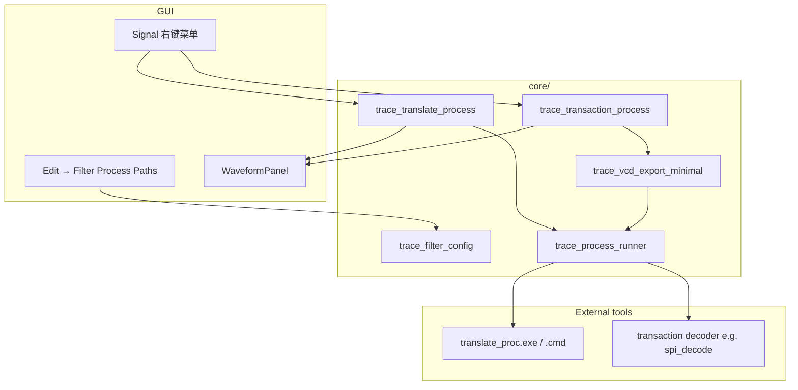

# Filter Process 实施规划（Translate + Transaction）

> **状态**：规划 · **阶段**：Phase 2（分析深度）  
> **前置**：Phase 1 核心调试（X/Z、模式搜索、FST 写、SST 过滤）可并行，无硬依赖  
> **与实时仿真**：**独立** — Filter 基于已加载 trace；live ingest 为可选后续增强  
> 对照：[BEAR2WAVE_VS_GTKWAVE.md](BEAR2WAVE_VS_GTKWAVE.md) §4.3

---

## 1. 目标与非目标

### 目标

| ID | 能力 | GTKWave 层次 | Bear2Wave 目标 |
|----|------|--------------|----------------|
| **FP-1** | Translate Filter Process | L2 | 外部进程按「信号+时间+值」翻译显示文本 |
| **FP-2** | Transaction Filter Process | L3 | 导出简化 VCD → 外部解码器 → 新 trace 行 + Marker |
| **FP-0** | 共享基础设施 | — | 进程启动、超时、缓存、配置、CLI 测试 |

### 非目标（本阶段不做）

- 实时仿真 / SHM / FIFO 联动（见 live trace 规划，后续可选）
- 100% GTKWave `transaction.c` 语法一次性对齐（分 MVP → Full）
- 内置 SPI/I2C 解码器（仅提供 **mock + 示例** 外部工具）
- 替换现有 **Translate Filter File**（L1 保留，`m_translateRules` 继续工作）

---

## 2. 现状盘点

| 组件 | 位置 | 现状 |
|------|------|------|
| Translate Filter File | `WaveformPanel::LoadTranslateFilterFile` | ✅ 正则规则文件 |
| Translate Filter Process 菜单 | `SignalTraceContextMenu` → `ID_TRANSLATE_PROC` | ⚠️ 占位：弹框加一条 `pattern=>replacement` |
| Transaction Filter Process 菜单 | `ID_TRANSACTION_PROC` | ⚠️ 占位：切 ASCII + 日志 |
| Transaction 行渲染 | `trace_display` / `WaveformPainter` | ✅ FST event → 紫色 transaction 行 |
| 外部进程模式 | `trace_external_convert.cpp` | ✅ CreateProcess + 管道 + 缓存（可复用） |
| 会话持久化 | `WaveformSession` | 未存 filter 进程路径 |

---

## 3. 总体架构



**原则**

1. **Translate**：行级、无全局状态；可缓存 `(sig_id, t, raw_value) → text`  
2. **Transaction**：批处理；输入为 **时间窗内、已选信号的简化 VCD**；输出解析为新 `signal_t` 或虚拟行  
3. **进程层** 从 `trace_external_convert` 抽出 `trace_process_runner`（stdin/stdout、超时、stderr 捕获）  
4. **不阻塞 UI**：Transaction 在 worker 线程；Translate 可 sync（单值 ms 级）或 async batch

---

## 4. Epic FP-0 — 共享基础设施（3–4 天）

| 任务 | 文件 | 说明 |
|------|------|------|
| FP-0-1 | `core/trace_process_runner.h/.cpp` | `run_process_io(cmd, stdin, timeout_ms) → {exit, stdout, stderr}` |
| FP-0-2 | `core/trace_filter_config.h/.cpp` | 扩展 `external_tools.cfg`：`translate_proc=`、`transaction_proc=`；env `BEAR2WAVE_TRANSLATE_PROC` / `BEAR2WAVE_TRANSACTION_PROC` |
| FP-0-3 | `ui/FilterProcessSettingsDialog.hpp` 或并入 External Tools | 两路路径 + Auto-detect + 超时(ms) |
| FP-0-4 | `tools/mock_translate_proc.cmd` | echo 回显或固定映射，供 test |
| FP-0-5 | `TraceTools test-fp0` | 进程 runner 单测 |

**验收**：`TraceTools test-fp0` PASS；GUI 可保存路径。

---

## 5. Epic FP-1 — Translate Filter Process（5–7 天）

### 5.1 语义（对齐 GTKWave L2 子集）

对 **每条 value change**（或 hover / 光标处），向外部进程写入一行，读取一行显示文本：

```
# stdin（UTF-8，一行）
<full_name>\t<time>\t<raw_value>\n

# stdout（一行，trim）
<display_text>\n
```

- 空 stdout 或 exit≠0 → 回退 raw / radix 显示 + 可选 stderr 提示  
- 超时默认 500ms（可配置）  
- 按 `(signal_id, timestamp, value_hash)` LRU 缓存，上限可 env 配置

### 5.2 任务分解

| ID | 任务 | 说明 |
|----|------|------|
| FP-1-1 | `trace_translate_process.cpp` | `translate_via_process(sig, t, raw, cfg)` |
| FP-1-2 | `WaveformPanel::FormatValueByDataFormat` | 在 `ApplyTranslateRules` **之前** 调用 process（若该 sig 启用 TR_TRANSLATE_PROC） |
| FP-1-3 | `m_signalTransformFlags` | 新增 `TR_TRANSLATE_PROC`；右键启用/禁用 |
| FP-1-4 | 替换 `ID_TRANSLATE_PROC` 占位 | 配置进程路径 / 选全局默认 / 对选中信号启用 |
| FP-1-5 | `WaveformRenderer` cache | `seg.text` 走同一 Format 路径（已调用 panel formatter） |
| FP-1-6 | 会话 | `.bwv` 保存 per-signal translate_proc 启用位 + 全局 exe 路径 |
| FP-1-7 | `TraceTools test-fp1` | mock 进程 + sample VCD 断言显示文本 |

### 5.3 UI 流程

1. 右键信号 → **Translate Filter Process** → 启用 + 使用全局 `translate_proc`  
2. Edit → **Filter Process Paths** → 设置可执行文件  
3. 与 **Translate Filter File** 叠加顺序：`Process → File rules → Radix`

### 5.4 验收

| 检查 | 期望 |
|------|------|
| mock_translate_proc | 总线值显示为 `DEC:xxx` 等自定义前缀 |
| 未配置进程 | 明确错误，不崩溃 |
| 1000 次 hover | 缓存命中，无明显卡顿 |
| Phase3 样例 FST/VCD | 显示正常回退 |

---

## 6. Epic FP-2 — Transaction Filter Process（2–3 周）

分 **MVP（1 周）** 与 **Full（1–2 周）**。

### 6.1 MVP 范围

**输入**：当前 `m_displayedSignals2`（或用户多选）+ 可见/全文件时间范围  
**输出解析子集**：

```
$name <trace_label>
#<time> <value>     → 数字 0/1 或字符串
```

生成 **虚拟信号行**（`VirtualTraceRow` 或临时 `signal_t` 包装）追加到显示列表；不修改源文件。

### 6.2 Full 范围（GTKWave 兼容增量）

| 行类型 | 含义 | 优先级 |
|--------|------|--------|
| `$name` / `$next` / `$finish` | 新 trace 生命周期 | P1 |
| `#time value` | 跳变 | P0 |
| `M time label` | 自动 Marker | P1 |
| `?color?` / `z` bar | 背景色 / 时间条 | P2 |
| `min_time` / `max_time` / `seqn` 头 | 上下文头 | P2 |

### 6.3 简化 VCD 导出

| ID | 任务 | 说明 |
|----|------|------|
| FP-2-1 | `core/trace_vcd_export_minimal.cpp` | 导出 `$scope/$var/$enddefinitions` + `#t` + 值；可选仅 0/1 压缩 |
| FP-2-2 | 时间窗 | 默认 `[m_timeOffset, m_timeOffset+m_displayTimeRange]`；对话框可选全文件 |
| FP-2-3 | `trace_transaction_process.cpp` | 写 temp VCD → spawn → 读 stdout 流式解析 |
| FP-2-4 | `TransactionFilterDialog` | 选进程、信号集、时间范围、Run |
| FP-2-5 | 输出绑定 | 新行 → `m_displayedSignals2`；Marker → `m_markers` |
| FP-2-6 | `tools/examples/spi_decode_mock.cmd` | 读 stdin VCD，输出 2–3 条 `$name` trace（CI 用） |
| FP-2-7 | `TraceTools test-fp2` | 端到端 mock 解码 |
| FP-2-8 | 文档 | 外部解码器编写指南（stdin/stdout 契约） |

### 6.4 数据模型选项（实现时二选一）

**方案 A — 虚拟行（推荐 MVP）**  
`struct VirtualTraceRow { std::string label; std::vector<DrawSegment>; wxColour; }`  
不进入 `vcd_t`，仅绘制 + hover。

**方案 B — 合成 signal_t**  
写入内存 `vcd_t` 扩展槽；与统计/搜索统一，改动较大。

建议：**MVP 用 A**；Full 阶段再评估是否合并到 `trace_vc`。

### 6.5 验收

| 检查 | 期望 |
|------|------|
| test-fp2 | mock 解码 → 新增 2 行 + 若干跳变 |
| GUI Run | 进度条、失败 stderr 对话框 |
| 大文件 | 仅导出选中信号 + 时间窗，内存可控 |
| 重复 Run | 清除上次虚拟行，不泄漏 |

---

## 7. 排期建议

```
Week 1     FP-0 共享 runner + 配置 + mock
Week 2     FP-1 Translate Process 全链路 + test-fp1
Week 3     FP-2 MVP：VCD export + mock decoder + 虚拟行
Week 4–5   FP-2 Full：Marker / $next / 会话 / 文档
Week 6     GUI 打磨 + FORMAT_PHASE6_ACCEPTANCE.md
```

与 Phase 1 **可并行**：FP-0/FP-1 不依赖 X/Z 完成；FP-2 建议在模式搜索之后（用户会搜解码结果）。

---

## 8. 测试与文档交付

| 交付物 | 路径 |
|--------|------|
| CLI | `TraceTools test-fp0` / `test-fp1` / `test-fp2` |
| 脚本 | `run_trace_tests.ps1` 增加 fp 段 |
| 验收 | `tests/FORMAT_PHASE6_ACCEPTANCE.md`（新建） |
| 解码器指南 | `docs/TRANSACTION_FILTER_DECODER.md`（FP-2 时写） |
| 路线图 | 更新 `BEAR2WAVE_VS_GTKWAVE.md` §4.3 状态 |

---

## 9. 风险与对策

| 风险 | 对策 |
|------|------|
| 外部进程挂死 | 超时 kill + 缓存；Transaction 仅后台线程 |
| Windows 路径/引号 | 复用 `trace_external_convert` 的 `shell_quote` |
| 简化 VCD 与解码器不兼容 | 文档明确契约；提供 reference mock |
| 虚拟行与 Compare/AI 统计 | MVP 文档标注「仅显示」；Full 再接入统计 |
| GTKWave 语法差异 | 分阶段对齐；单元测试按行类型覆盖 |

---

## 10. 实现顺序（给开发者的 Checklist）

- [ ] FP-0-1 `trace_process_runner`
- [ ] FP-0-2 `trace_filter_config` + cfg 字段
- [ ] FP-0-3 Settings UI
- [ ] FP-1-1 … FP-1-7 Translate 全链路
- [ ] FP-2-1 … FP-2-3 Transaction MVP
- [ ] FP-2-4 … FP-2-8 Transaction Full + 文档
- [ ] Phase6 验收 + 矩阵更新

---

## 11. 参考

- GTKWave Filter 三层：`docs/BEAR2WAVE_VS_GTKWAVE.md` §4.3  
- 外部工具模式：`docs/EXTERNAL_CONVERTERS.md`  
- 现有占位：`TEST1/panels/WaveformPanel.hpp` (`ID_TRANSLATE_PROC`, `ID_TRANSACTION_PROC`)  
- Transaction 渲染：`tests/FORMAT_PHASE3_ACCEPTANCE.md` E3-1
